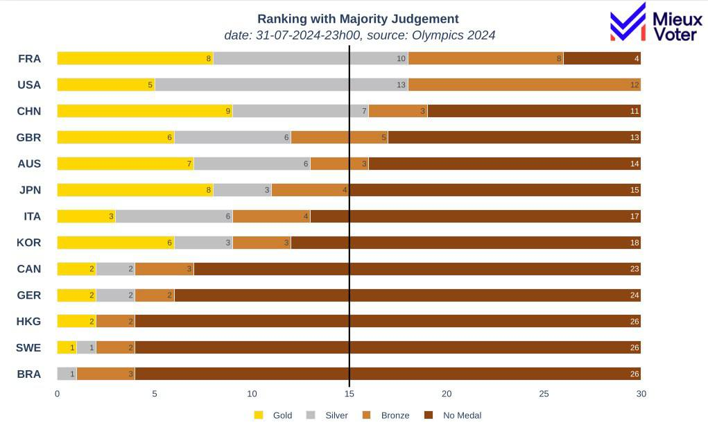

# Olympic Medal Ranking Comparator

## In short
Olympic medal analysis by comparing traditional ranking methods with Majority Judgment, 
offering a fresh perspective on national performance through visualizations.

## Our Approach
We decided to apply the Majority Judgment method to obtain a more balanced ranking, 
taking into account both the type and quantity of medals won by each country.

## When France was 1st with Majority Judgment
### Methodology
1. Each type of medal (gold, silver, bronze) is associated with a grade.
2. For countries that haven't won certain types of medals, we added a "chocolate medal" equivalent to the least favorable grade.
3. The ranking is then carried out according to the principles of Majority Judgment.
### Results

*Caption: Olympic Games country ranking according to the Majority Judgment method*
According to our analysis using Majority Judgment, France currently ranks first, 
ahead of the United States and China.

## Features
- Real-time Olympic data 2024 scraping
- Multiple ranking systems:
  - Lexicographic (prioritizing gold, then silver, then bronze)
  - Majority Judgment
  - Total medal count
- Interactive Plotly table for visual comparison
- Customizable minimum medal threshold for country inclusion

## Requirements
- Python 3.12
- pandas
- plotly
- numpy
- [mjtracker](https://github.com/MieuxVoter/majority-judgment-tracker) (for Majority Judgment calculations) 

## Contributing
Contributions are welcome! Please feel free to submit a Pull Request.

## License
This project is licensed under the MIT License - see the [LICENSE](LICENSE) file for details.
